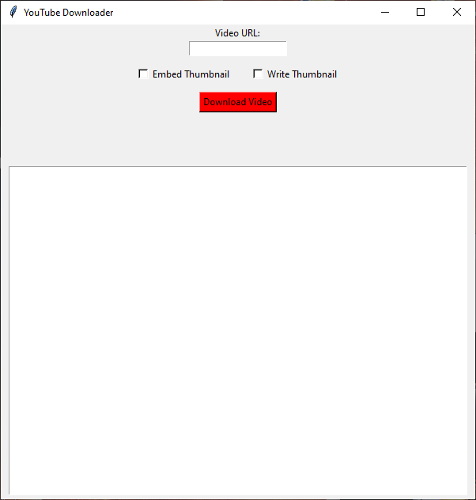

  

Welcome to YTDL, a powerful and user-friendly software program designed to enhance your Youtube experience by allowing you to download playlists and videos with ease. Whether you want to enjoy your favorite videos offline or maintain a personal collection, YTDL has got you covered.

## GUI Preview

  

### GUI Options:
- Download video thumbnail seperatly (write thumbnail)
- Download the video with it's thumbnail combined (embed thumbnail)

## GUI Features
**The GUI will have future updates**

YTDL comes packed with a range of features to meet your video downloading needs:

### 1. Download Full Playlists

With YTDL, you can effortlessly download entire playlists from Youtube (make sure that they aren't private!).

### 2. High-Quality Downloads

We understand the importance of audio and video quality. YTDL lets you download your music in high quality (320k) at 1080p+, ensuring that you enjoy your favorite video with the best sound possible.

### 3. Download Videos
Yes, of course, YTDL does infact download youtube videos duh!

## Getting Started

Follow these steps to get started with SpotiDL:

1. **Installation:** Download and install YTDL from the [Github Releases](https://github.com/OmiiiDev/YTDL/releases/)).

2. **Select Your Content:** Choose your desired video or playlist, copy it's link and paste it in the YTDL GUI.

3. **Start Downloading:** Hit the download button, choose where yu want the video to download, and watch as YTDL works its magic, grabbing your selected content and saving it to your designated storage location.

4. **Enjoy Your Music:** Once downloaded, your video is ready for offline viewing. Play it on your favorite media player, device, or wherever you prefer.

## Connect on Discord for support and try out my own custom SpotiDL Discord bot! [Discord Server](https://discord.gg/dG2gdxWHJp)

Join our vibrant Discord community to unlock the complete potential of SpotiDL, including a powerful Discord bot that can download songs and playlists! Engage with fellow users, discover more software offerings, and access dedicated support for any troubleshooting or bug-related queries.

## Contributions and Issues

YTDL is an open-source project, and contributions from the community are highly appreciated. If you find a bug, have an idea for an improvement, or want to contribute in any way, please check out our [GitHub repository](https://github.com/OmiiiDev/ytdl) for more information.

## Support

For any questions, troubleshooting, or feedback, feel free to contact our support team at redrockstudiosz7@gmail.com . We're here to help you get the most out of YTDL.

## License

YTDL is released under an All Rights Reserved license. The source code is not available for modification or distribution. You can use SpotiDL solely for personal use and enjoyment of your Spotify content.

---

Thank you for choosing YTDL to enhance your Youtube experience. We hope you enjoy the convenience and flexibility it brings to your video collection. Happy downloading!
